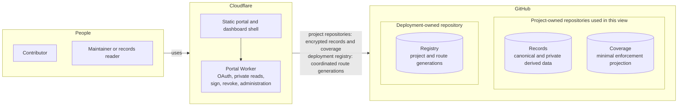
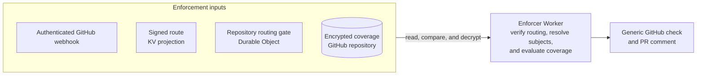
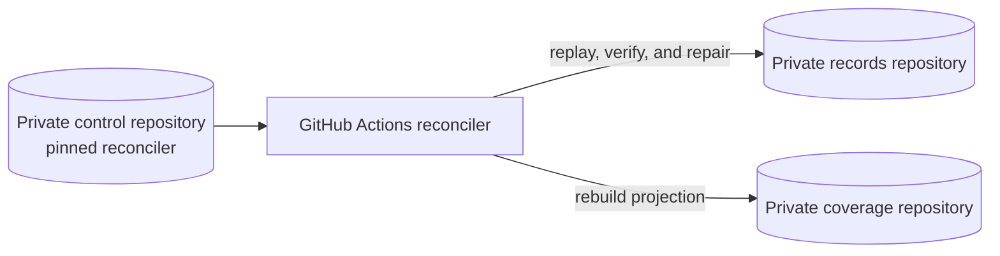
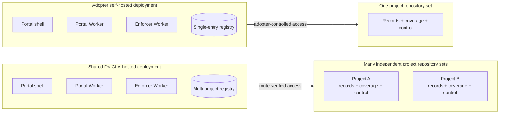
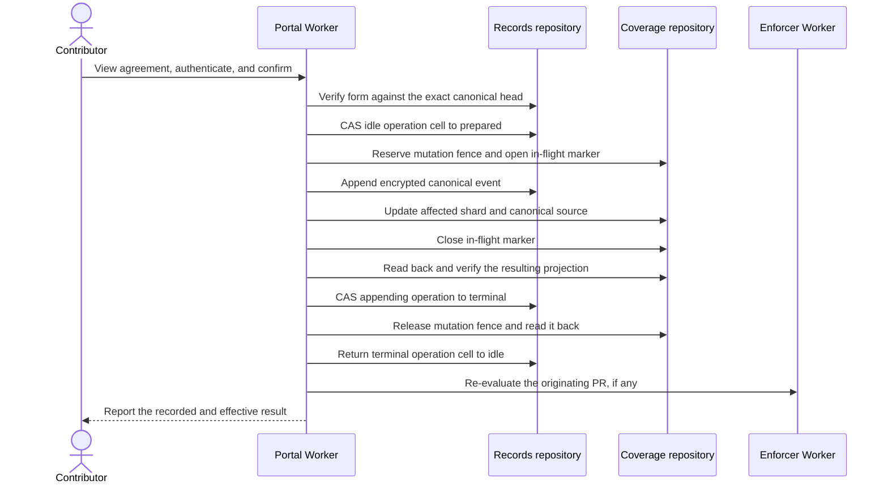
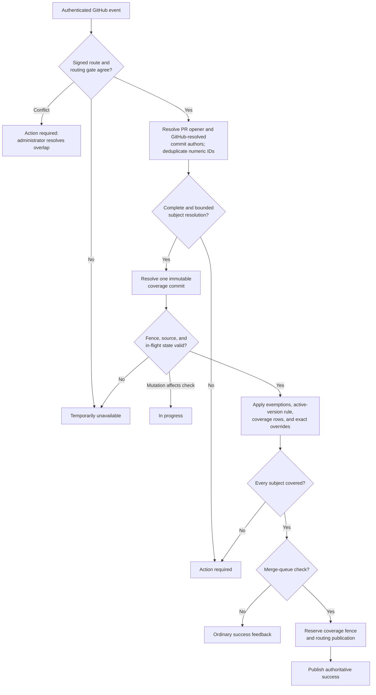
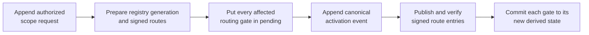

# DraCLA architecture overview

This document is the short, human-oriented map of DraCLA. It explains the
system's intended boundaries and main flows without reproducing the protocol
specification.

> [!IMPORTANT]
> DraCLA is currently a reviewed design and protocol spike, not a usable CLA
> service. The architecture below describes the locked revision-13 design.
> The Python code in `core/` predates that design and is retained only for
> concurrency and GitHub transport experiments.

For normative behavior and exact schemas, see the
[requirements](../design/requirements.md) and
[high-level design](../design/high-level-design.md).

## Architecture in one minute

DraCLA uses GitHub as both identity provider and durable system of record. A
project owns three private repositories:

1. a **records repository** containing encrypted canonical events and private
   derived views;
2. a **coverage repository** containing only the encrypted, minimal projection
   needed to answer pull-request checks; and
3. a **control repository** containing pinned reconciliation code and the
   secrets needed to verify and repair the first two repositories.

Cloudflare hosts the public, stateless request paths. Two Workers deliberately
hold different credentials: the portal side can handle private records, while
the Internet-facing enforcer can read coverage but cannot decrypt signer
evidence. Small repository-scoped Durable Objects protect routing transitions;
they do not store CLA records.

The system is easier to understand through three views, each answering a
different question.

**Contributor and administration view — how do people read or change state?**

Each view shows only the components involved in that path. The project's
control repository appears in the operations view below.

**Enforcement view — how does a repository receive a CLA decision?**

**Operations view — how is derived state verified and repaired?**

The control repository does **not** contain or deploy the portal. It belongs to
one DraCLA project and contains only that project's pinned reconciler workflow,
provenance and bootstrap manifests, inert wrapped control keyring, and Actions
secrets. Its job is protected verification and repair; it is never shared with
another project's records, coverage, keys, or recovery state.

### Hosted and self-hosted portals

The portal shell and Portal Worker are **deployment-scoped services**, not
contents of a project's control repository. Their source is released with the
DraCLA application and deployed to Cloudflare alongside the Enforcer Worker.
Repository routing selects the one project whose keys and repositories a
request may use.

The default hosted service shares one portal and enforcer deployment across
many projects, but every project keeps its own three repositories, data keys,
recovery material, evidence, routing state, and control workflow. Compromise of
the shared hosted operator remains inside the trust boundary described below;
repository separation does not remove that operator trust.

The self-hosted mode deploys the same released two-Worker code and portal shell
in the adopter's Cloudflare and GitHub accounts, with adopter-controlled
wrapping roots and a single-entry registry for one project repository set. An
optional self-hosted variant may compute the bounded enforcement decision in
the control workflow, but even that variant does not place the portal in the
control repository.

The most important design rule is that **canonical evidence and enforcement
data are different capabilities**. The enforcer needs to know whether a GitHub
user is covered; it does not need their legal name, email address, confirmation
text, or the reason an exemption exists.

## Components and responsibilities

| Component | Responsibility | Explicitly does not do |
|---|---|---|
| Static portal/dashboard | Serves public assets and the authenticated UI shell | Store or embed private records |
| Portal Worker | GitHub OAuth, signing, revocation, administration, scoped private reads, synchronous projection updates, routing coordination, and worker-side recovery | Receive pull-request webhooks, write checks, provision repositories, or return raw project keys to browsers |
| Enforcer Worker | Verify GitHub webhooks, resolve PR subjects, read coverage, publish checks and one generic PR comment | Read or decrypt canonical signer evidence |
| Routing registry | Record the deployment's project and repository assignments as immutable generations | Store signer data or project keys |
| Signed route projection | Give edge requests a fast repository-to-project route | Act as authority without the matching routing gate |
| Routing gate | Strongly serialize one repository's route transitions and authoritative-check publication | Store CLA evidence or replace GitHub as the system of record |
| Records repository | Hold encrypted append-only evidence, current configuration, private indexes, operation recovery state, and wrapped key metadata | Expose plaintext to ordinary repository readers |
| Coverage repository | Hold encrypted effective coverage, active-version state, mutation state, and the decision fence | Hold names, emails, confirmation text, exact private reasons, or reader policy |
| Control repository | Hold pinned reconciler code and project-scoped secrets | Accept writes from the records or enforcer Apps |
| Reconciler | Replay canonical events, verify and repair projections and private indexes, and produce requested hosted exports | Define new business truth independently of canonical events |
| `dracla` CLI | Provision with the administrator's credentials; later verify, report, export, and rotate keys | Retain provisioning power in a hosted DraCLA App |

Three narrowly scoped GitHub Apps support these components:

- `dracla-records` authenticates portal users and writes encrypted records and
  coverage materializations.
- `dracla-enforcer` receives pull-request, merge-queue, and event-wide
  `check_run` events, reads only coverage, and writes checks and the generic PR
  comment. Only an exact DraCLA authoritative completion may confirm its
  matching publication reservation.
- `dracla-reconciler-trigger` can dispatch the one pinned control workflow but
  cannot read or modify repository content or secrets.

### The portal is the records-side control plane

The static shell contains no private project data. The Portal Worker behind it
is the authenticated boundary for people: it establishes GitHub sessions,
serves the public agreement payload, shows a contributor their own status, and
serves scoped dashboard or status results only after current records-reader
authorization has been established. Unwrapped project keys stay inside the
Worker; browsers receive only public agreement data or the scoped plaintext
result they are authorized to see.

The portal is also the only interactive path for canonical project actions. It
rechecks the actor's current, action-specific GitHub authority; binds the
submitted action to the exact project and canonical head the person reviewed;
appends the attributable canonical event; and synchronously materializes any
corresponding encrypted coverage or bounded private-derived updates. Signing,
revocation, agreement versions, exemptions, records readers, overrides, and
enforcement-scope administration all enter through this records-side path
rather than through a separate admin service.

Some administrative decisions need facts that the records-side credentials
cannot inspect, such as permission on a private contributing repository. The
portal asks the Enforcer Worker for a narrowly scoped, authenticated permission
result; no user or installation token crosses that service boundary. The
portal then records the returned authorization evidence with the event.

Beyond browser requests, the Portal Worker coordinates registry generations
and routing-gate transitions, observes configured continuous-team rules, and
recovers interrupted prepared operations. If synchronous repair cannot finish,
it uses the trigger-only App to dispatch the pinned reconciler in the project's
control repository. It does not receive pull-request webhooks or publish check
runs; those remain the enforcer's job.

This makes the portal intentionally more trusted than the enforcer. It holds
the records capability as well as the coverage capability, so compromise can
expose or forge canonical evidence and affect routing. The Internet-facing
enforcer is separated specifically so its compromise cannot decrypt signer
records. Provisioning is separate again: the future CLI uses the
administrator's own GitHub credentials, so the portal retains no repository-
administration, workflow-write, or secret-write authority.

## Project-owned data

Each DraCLA project represents one immutable legal recipient and, in the
initial release, one agreement identifier with multiple immutable versions.
One repository set may enforce that agreement across many contributing
repositories. Enforcement scope selects where checks run; it does not define
or rewrite the legal scope of an acceptance.

### Records repository

The records repository separates data by branch:

| Branch | Contents |
|---|---|
| `events` | Canonical encrypted events, immutable agreement snapshots, current encrypted configuration, and materialization generations |
| `derived` | Rebuildable encrypted dashboard, exact-status, reader-authority, and requested-export artifacts |
| `operations` | The single encrypted prepared-operation cell used for crash recovery |
| `keys` | Wrapped project-key copies and non-secret key metadata |

Canonical order is Git commit ancestry, not timestamps. Each logical event is
one single-parent commit. Writers only advance the branch by a non-forced
fast-forward; after a race they reload the new head, revalidate the operation,
and rebuild the tree on that head before retrying.

### Coverage repository

Coverage is a rebuildable projection optimized for the check path. It contains:

- 32 encrypted user shards selected by numeric GitHub user ID;
- the active agreement version and accepted-version set;
- effective exemptions, without their private provenance;
- exact PR/tree-bound overrides in the relevant user rows;
- the canonical source commit from which the projection was built;
- one in-flight operation marker; and
- one decision fence that serializes mutations against authoritative success.

The fixed 32-shard profile bounds a Free-tier check to at most 32 subject-shard
reads. A projection-format version makes an unsupported layout fail closed
instead of being guessed from repository contents.

### Encryption boundary

Every private artifact uses a versioned AES-256-GCM envelope. Associated data
binds ciphertext to its project, capability, logical path, schema, and key ID.
Each project has separate records and coverage data keys, and each key is
wrapped separately for the principals allowed to use it.

This means private GitHub repositories are defense in depth, not the primary
confidentiality boundary. A repository reader without the matching decryption
capability sees ciphertext and repository metadata.

## Main flows

### Signing and revocation

The portal displays the complete agreement, recipient, version, required
fields, privacy policy, and retention statement before authentication is
required. After GitHub login, the server issues an authenticated form bound to
the exact canonical head and displayed operation. A stale form cannot silently
apply to newer project state.

The prepared cell freezes the complete authorized operation before the
cross-repository mutation starts. If any process crashes, a later portal
request or the reconciler can finish that exact operation without the original
browser request. No state is cleared merely because it is old.

Revocation follows the same protocol. It appends evidence rather than deleting
an acceptance and cuts off coverage for future merge decisions. Restoring
coverage requires a fresh acceptance of the active agreement.

### Pull-request checks

An ordinary check is early feedback. The authoritative decision is made for
the pull request's own merge-queue entry immediately before landing.

Subjects are the pull-request opener and every commit author that GitHub can
resolve to a numeric user ID. `Co-authored-by` trailers are displayed only in
the permission-graded PR detail view; they do not block by default because
unauthenticated trailer text would create a coverage oracle and jamming vector.

Public output is deliberately coarse: **CLA satisfied**, **action required**,
or **temporarily unavailable**. Authenticated detail is graded:

- a contributor sees their own status;
- a maintainer with write access sees aggregate reason counts; and
- a current records reader may see named subjects and per-subject reasons.

### Why authoritative success uses two reservations

A merge-queue success must not race either a coverage change or a repository
route change. DraCLA therefore holds:

1. a `success_reserved` state in the coverage repository's decision fence; and
2. a publication reservation in the repository's strongly consistent routing
   gate.

Only then does it create the completed GitHub success check. The coverage
reservation is released after validating GitHub's response. The routing
reservation remains until an authenticated completion webhook, or scheduled
recovery after an exact GitHub read, independently confirms that same check.
Ambiguous outcomes remain reserved and fail closed.

### Routing and scope changes

The deployment has one private registry that maps immutable GitHub repository
IDs to DraCLA projects. Its runtime projection is signed and cached in KV, but
KV is eventually consistent, so it is never trusted alone.

Every enforcement request compares the signed route with a repository-scoped
Durable Object containing the expected state and generation. A mismatch,
pending transition, missing gate, invalid signature, or observed repository
identity change affects only that repository and fails closed.

Scope mutations use a staged handoff:

Within one deployment, a repository may belong to only one DraCLA project.
GitHub-side lifecycle changes can still create overlap; in that case the route
becomes `conflict`, the check fails closed, and DraCLA does not choose a winner.

## Consistency and recovery model

DraCLA has no multi-repository transaction, so correctness comes from explicit,
recoverable state machines:

- **Canonical append:** one event per commit, linear ancestry, deterministic
  idempotency, and semantic revalidation after races.
- **Repository-local updates:** exact branch-head compare-and-swap commits for
  operation, coverage, and derived-state transitions.
- **Prepared operation:** durable recovery payload written before coverage can
  change.
- **In-flight marker:** opened before canonical append and closed only after
  the projection is effective.
- **Decision fence:** prevents an authoritative success from crossing a
  coverage mutation.
- **Routing gate:** prevents an authoritative success from crossing a route
  transition.
- **Replay:** canonical events are the source of truth; coverage and private
  derived views can be verified and rebuilt.

The general failure policy is conservative: missing, corrupt, mismatched,
oversized, stale, or unavailable state never produces a passing check.

## Security and trust boundaries

The design reduces privilege but does not claim a trustless hosted service.

| Principal or failure | Maximum intended reach |
|---|---|
| Compromised enforcer Worker | Decrypt coverage and forge checks; cannot modify coverage or decrypt canonical signer evidence |
| Compromised portal Worker | Read or forge canonical evidence and coverage; alter routing through its coordinator capability |
| Compromised control workflow | Read/forge that project's records and coverage and repair outputs |
| Ordinary private-repository reader | Ciphertext and repository metadata only |
| Hosted DraCLA operator | Trusted for signer confidentiality, evidence integrity, and merge-gate integrity across hosted projects |
| Self-hosted adopter | Controls its own Workers, wrapping roots, and operational trust boundary |

The two-Worker split limits the most exposed component's access to personal
data, but either Worker can still affect merge-gate integrity. Self-hosting is
the supported way for an adopter not to trust the shared operator with records
plaintext and evidence integrity.

The coverage projection is also private even though it omits names and emails.
Publishing a complete `user ID -> covered?` directory would create the public
signer lookup that the product explicitly forbids.

## Deployment and operations

The baseline deployment uses:

- Cloudflare Pages or Worker-served static assets on the same origin as the
  authenticated API;
- two Cloudflare Workers with disjoint secret bindings;
- signed KV routes plus SQLite-backed Durable Objects for routing gates;
- three private GitHub repositories per project;
- one private deployment registry repository; and
- one daily pinned GitHub Actions reconciliation run per project's control
  repository, plus exceptional repair or explicit hosted-export runs.

Agreement markup is rendered on a separate, cookieless origin in a sandboxed
frame because project-supplied content is untrusted. The authenticated shell
and API remain same-origin so session cookies can use `SameSite=Lax` without a
credentialed cross-origin policy.

The shared hosted deployment and every independent self-hosted deployment are
separate coordination domains. DraCLA can prevent overlapping assignments
inside one domain, not between independently operated deployments.

## What exists in this repository today

| Path | Current role |
|---|---|
| `design/requirements.md` | Locked revision-13 product and security requirements |
| `design/high-level-design.md` | Locked, reviewed, normative architecture and protocol design |
| `core/dracla/` | Legacy plaintext protocol spike: event IDs, fast-forward append, packed-shard race experiments, fake Git host, and live GitHub transport |
| `core/tests/` | Concurrency, protocol, transport, capacity, and opt-in live GitHub integration tests for the spike |
| `api/bench/` | Historical pre-encryption Worker CPU lower-bound benchmark |
| `core/capacity.py` | Parameterized request and capacity model |
| `docs/roadmap.md` | Implementation order and open release gates |

The conforming encryption envelope, revision-13 event model, prepared cell,
decision fence, Workers, portal, reconciler, installer, dashboard, reporting
CLI, routing gates, and badges have not been implemented. In particular, the
legacy `core/` projection uses plaintext and 256 shards; it must not be used to
write project data.

## Where to go deeper

- [Requirements](../design/requirements.md) — what the product must do.
- [High-level design](../design/high-level-design.md) — exact protocols,
  schemas, authorization rules, risk analysis, and traceability.
- [Development roadmap](roadmap.md) — implementation order and release gates.
- [GitHub App capability inventory](github-apps.md) — concise App permissions.
- [Core spike notes](../core/README.md) — what the current Python experiments
  do and do not prove.
